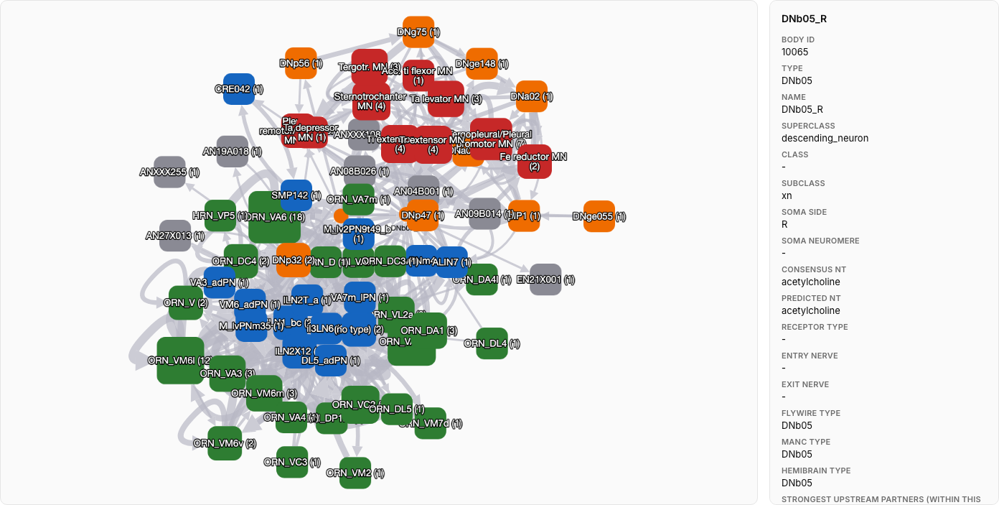

# Drosophila Under the Hood

**[Live demo → duth.abstraction.engineer](https://duth.abstraction.engineer)**

**How are sensory inputs connected to the outputs of a fly's nervous system?**
Explore the Janelia male *Drosophila* CNS connectome (`male-cns:v1.0`):
follow anatomical paths, inspect individual neurons, and see what the wiring
can — and cannot — tell us about computation.

The interactive explorer connects a whole-CNS I/O map to selected neuronal
subgraphs and 2D/3D anatomy. **Wiring to Computation** introduces recurrent
activity, modelling assumptions and controlled experiments for ML engineers.
An R → Python pipeline makes the analysis and browser exports reproducible.



*An anatomical route to investigate: smell → front leg, with DNb05 selected.
The displayed subgraph is a filtered selection, not the complete circuit or
evidence that these connections drive a particular behaviour.*

## Quick start

From the repository root, serve the included browser exports with Python 3:

```sh
python3 -m http.server 8000 --directory app
```

Open [localhost:8000](http://localhost:8000). The core explorer runs without
R, a neuPrint token, or rebuilding the data. Its plotting libraries load
from a CDN, so an internet connection is needed.

**Optional data:** global neuron search and per-neuron 3D morphology require
`app/data/search_index.json` and `app/data/skeletons/`. These large exports
are gitignored; generate them with the full pipeline below. The included
pathway graphs, neuron metadata and soma-position anatomy views work without them.

## A first exploration

1. **Start Here:** get oriented to the dataset and the roles of sensory,
   processing and output neurons.
2. **Wiring to Computation:** connect anatomical wiring to recurrent models,
   familiar ML concepts and experiments that test what connectivity contributes.
3. **Try it: smell → front leg:** follow the example link to DNb05 in Pathway
   Explorer. Raise the synapse-count threshold and inspect which connections
   remain in the loaded subgraph.

Use **Overview** and **I/O Matrix** to choose other input/output combinations;
use **Anatomy** and **Anatomy 3D** to see the recorded soma positions of
140,024 neurons (84.8% of the 165,122 traced neurons).

For more depth, read the [ML cheat sheet](docs/ml_cheat_sheet.md) or the
[project overview](docs/project_overview.md).

## What the explorer can tell you

Connections and synapse counts constrain possible models; synapse counts
are not measured physiological weights. Transmitter labels alone do not
fully determine whether a connection excites or inhibits its target.

Paths and traversal layers describe anatomy, not elapsed time or observed
neural activity. **Dynamics** is an illustrative model on 24 groups, not a
validated physiological simulation. The dataset represents one individual;
its wiring alone does not establish a behavioural mechanism.

## Reproduce the data and analysis

The full pipeline queries neuPrint, classifies neurons, builds aggregate
maps and selected pathways, and exports the files consumed by the static app.

### Prerequisites

- R (>= 3.5)
- The `malecns` package and its dependencies (installed manually, per the
  [malecns README](https://github.com/natverse/malecns#installation)):

  ```r
  install.packages("natmanager")
  natmanager::install(pkgs = "natverse/malecns")
  install.packages(c("arrow", "jsonlite", "dplyr"))
  ```

  `arrow` writes the connectivity and skeleton Parquet files; `jsonlite`
  and `dplyr` support the extraction scripts.

- A neuPrint token, set as `NEUPRINT_TOKEN` in your `~/.Renviron` (see
  [neuprintr authentication](https://github.com/natverse/neuprintr#authentication)).
  Never commit this token; `.gitignore` already excludes `.Renviron` and `.env` files.
- Python 3.11+ and [`uv`](https://docs.astral.sh/uv/) for the analysis layer.

### Pipeline

```sh
# 1. R: extract the census, connectivity, and neuron positions
Rscript r/build_io_census.R
Rscript r/build_io_connectivity.R
Rscript r/build_neuron_positions.R

# 2. Python: classify, aggregate, build graphs/matrix/pathways, simulate
uv sync
uv run python -m io_analysis.classification
uv run python -m io_analysis.aggregation
uv run python -m io_analysis.graph
uv run python -m io_analysis.dynamics
uv run python -m io_analysis.export_positions
uv run python -m io_analysis.export_app_data
uv run python -m io_analysis.export_start_animation
uv run python -m io_analysis.primer_stats

# 3. Global search + per-neuron 3D morphology (needs app/data/pathways/
# from export_app_data above; the R step needs data/skeleton_bodyids.csv
# from list_skeleton_targets, and takes about an hour for 6,895 neurons)
uv run python -m io_analysis.list_skeleton_targets
Rscript r/build_neuron_skeletons.R
uv run python -m io_analysis.export_skeletons
uv run python -m io_analysis.export_search_index

# 4. Serve the app
python3 -m http.server 8000 --directory app
# open http://localhost:8000
```

`r/smoke_test.R` and `r/inspect_neuron.R` are standalone diagnostics, not
part of the main pipeline - run them any time to sanity-check the neuPrint
connection.

The app export also refreshes `data/io_matrix.csv` and any existing
standalone examples under `data/pathways/` from the same results used for
the browser JSON. The manifest records the complete classifier source
hash and whether the recorded Git commit has local changes.

Step 3 generates the optional search and morphology exports (approximately
295 MB combined, counting the search index and the 6,895 skeletons listed
in the manifest). It is needed only when rebuilding those features locally.

## Testing

```sh
uv run pytest tests/
# Frontend state regressions (Node.js 18+; no npm dependencies):
node --test tests/app_state.test.cjs
```

Tests cover classification, graph metrics, pathway pruning, data loaders,
and browser exports using small graphs and synthetic files. Regression
cases include motor-target precedence, complete-route preservation,
invalid IDs/weights, mismatched manifests, undefined normalization,
coverage accounting, and CSV/JSON agreement. Tests also check traversal
layers and unreached neurons in `primer_stats`, plus edge validation,
sampling and starting-neuron counts in the Start Here animation exporter.

Frontend tests cover responses arriving out of order, clearing neuron details,
restoring linked views, and searches waiting for the index. They also check
the Start Here animation captions and the Wiring to Computation “Try it”
link, including modified clicks. They stub plotting and layout; visual
behavior still needs a browser check.

## Data & citation

Dataset: `male-cns:v1.0`, licensed
[**CC-BY 4.0**](https://creativecommons.org/licenses/by/4.0/) by FlyEM
(HHMI Janelia), the Cambridge Drosophila Connectomics Group / MRC LMB, and
Google Research.

If you use or build on this data, cite:

> Berg, S., Beckett, I.R., Costa, M., et al. "Sexual dimorphism in the
> complete connectome of the *Drosophila* male central nervous system."
> *Cell* 189(18), 5504-5526 (2026). DOI:
> [10.1016/j.cell.2026.08.015](https://doi.org/10.1016/j.cell.2026.08.015).
> (Preprint: [bioRxiv 10.1101/2025.10.09.680999](https://doi.org/10.1101/2025.10.09.680999).)

Accessed via [neuPrint](https://neuprint.janelia.org) through the
[`malecns`](https://github.com/natverse/malecns) R package.

Project release: **1.1.0** — see [release notes](CHANGELOG.md).
The project version is independent of the source dataset version
(`male-cns:v1.0`) and the classification rule version recorded in exports.

## Structure

```
r/            R extraction scripts (neuPrint -> CSV/Parquet)
src/io_analysis/   Python analysis (classification, graphs, dynamics, app data export)
tests/        Python unit/regression tests and frontend state tests
app/          Static interactive explorer (no backend)
data/         Extracted/derived tables (large raw files gitignored)
docs/         Project overview, ML cheat sheet, domain reference, facts.md, classification rules
results/      Validation reports
```
